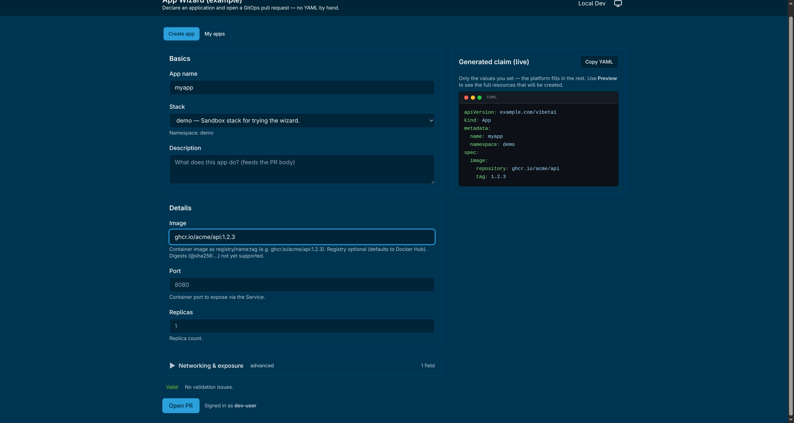

# App Wizard

**A schema-driven self-service wizard that turns any Crossplane XRD into a reviewable GitOps pull request — no YAML by hand.**

Point it at your GitOps repo and a Crossplane `CompositeResourceDefinition`; it
generates a progressively-disclosed form from the XRD's schema, validates input
(OpenAPI + CEL + secret scanning), previews the resources the claim will compose
into, and opens a pull request **as the signed-in developer**. The wizard holds
no cluster credentials — its blast radius is one Git repository.

> Extracted from [`Smana/cloud-native-ref`](https://github.com/Smana/cloud-native-ref),
> where it began as SPEC-008. That repo's `docs/specs/009-app-wizard-oss-split/`
> holds the extraction spec.



*The form above is generated entirely from the bundled example XRD — the fields,
the defaults, and the `example.com/v1beta1` claim GVK all come from it, nothing
is hardcoded. Run it yourself with `make dev`.*

## Why

Declaring an app on a Crossplane platform means knowing the claim schema, the
repo layout, the secret conventions, and the network-policy traps — then
hand-writing YAML and assembling a PR. The wizard replaces that with a form
**generated from the XRD** (single source of truth, zero drift) and a PR opened
under the developer's own identity. Reviewers read *outcomes* (the rendered
resources), not 40 lines of claim YAML.

## How it works

```
React SPA ──► Go backend (single binary)
               │  /api/schema          XRD → JSON Schema + CEL + ui-hints + stacks
               │  /api/validate        OpenAPI + CEL + secret scan
               │  /api/render-preview  crossplane render (optional)
               │  /api/pr              branch + files + PR as the user
               ▼
      <repo>/<layout>/ ──► your GitOps controller ──► cluster
```

The form is generated from the XRD, so a new field on the XRD appears in the
wizard on the next restart with **no code change**. Claim `apiVersion`/`kind`
are read from the XRD — nothing is hardcoded to a particular platform.

## Quickstart

Run against the bundled example (no Crossplane cluster required — dev auth, local
git provider):

```bash
make dev        # builds the SPA, runs the binary against examples/
```

Then open <http://localhost:8080>.

To run against your own platform, provide a `wizard.yaml` and the GitHub OAuth
secrets (see [Configuration](#configuration)) and run the container:

```bash
docker run --rm -p 8080:8080 \
  -v "$PWD/wizard.yaml:/config/wizard.yaml:ro" \
  -e GITHUB_CLIENT_ID=... -e GITHUB_CLIENT_SECRET=... -e SESSION_KEY=... \
  ghcr.io/smana/app-wizard:latest
```

## Configuration

Non-secret configuration lives in **`wizard.yaml`** (repo coordinates, XRD/stacks
paths, PR file-layout template, render engine, branding, LLM assists). Secrets
(`GITHUB_CLIENT_SECRET`, `SESSION_KEY`, `LLM_API_KEY`) are supplied **via
environment only** and are never read from the file. Environment variables
override file values.

See [`examples/wizard.yaml`](examples/wizard.yaml) for a complete, commented
example, and [`docs/configuration.md`](docs/configuration.md) for the full
key-by-key reference (every `wizard.yaml` key, its env override, and its default).

The claim `apiVersion`/`kind` are **not** configured — they are read from the
XRD (`spec.group` + served version + `claimNames.kind`/`names.kind`), so pointing
`schema.xrdPath` at your XRD is all it takes.

## Authentication

`auth.mode` selects the login backend:

| Mode | Login | Opens PRs as | Notes |
|------|-------|--------------|-------|
| `github` (default) | GitHub OAuth | the GitHub user | login token IS the PR token |
| `dev` | none | — | local development only |

## Security model

- The wizard opens PRs with the **user's own** GitHub token; it holds no
  long-lived Git credentials and no cluster credentials.
- There is **no secret-value input**: only ExternalSecret references and
  non-sensitive literals. Server-side entropy/pattern scanning refuses any PR
  whose content looks like a credential.
- The runtime is a distroless, non-root image.

## Development

```bash
go run ./cmd/app-wizard               # backend on :8080
cd ui && npm install && npm run dev   # frontend dev server, proxies /api
go test ./... && (cd ui && npm test)  # tests
```

## License

[Apache-2.0](LICENSE). Copyright 2026 Smaine Kahlouch.
